# pipeline-filmes

Pipeline de dados end-to-end construído do zero — da coleta até consulta SQL na nuvem, seguindo a arquitetura medallion (Bronze → Silver → Gold).

---

## O que esse projeto cobre

- Pipeline ETL em Python (extração, limpeza e transformação)
- Arquitetura medallion no S3 (Bronze / Silver / Gold)
- Particionamento dos dados por década na camada Gold
- Infraestrutura de rede na AWS (VPC, subnets, route tables)
- Replicação cross-region para backup (us-east-1 → sa-east-1)
- Catalogação dos dados com AWS Glue
- Consultas SQL direto no S3 com Amazon Athena

---

## ETL — o que o pipeline faz

**Extract**
- Lê o CSV da camada Bronze

**Transform**
- Remove linhas sem nome de filme
- Remove colunas desnecessárias: `MetaScore`, `Gross`, `Certification`
- Insere coluna `data_extracao` no final

**Load**
- Salva o CSV transformado na camada Silver
- Faz upload do dado bruto para o S3 Bronze
- Faz upload do dado transformado para o S3 Silver

**Gold**
- Separa os filmes por década (1910–2030)
- Gera um CSV por período — o volume cresce visivelmente com o tempo (1.4 KB na década de 1910, 1.3 MB na de 2010)
- Sobe os arquivos para o bucket Gold

---

## Infraestrutura AWS

### Rede

VPC dedicada (`pipeline-filmes-vpc`) configurada na região us-east-1, com 4 subnets distribuídas em 2 Availability Zones. Subnets públicas e privadas separadas, com Internet Gateway e VPC Endpoint para S3.

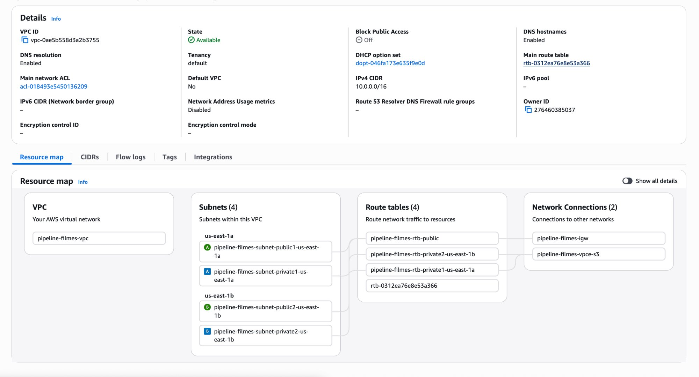

### Armazenamento

4 buckets S3 — três na Virgínia (Bronze, Silver, Gold) e um em São Paulo para backup.

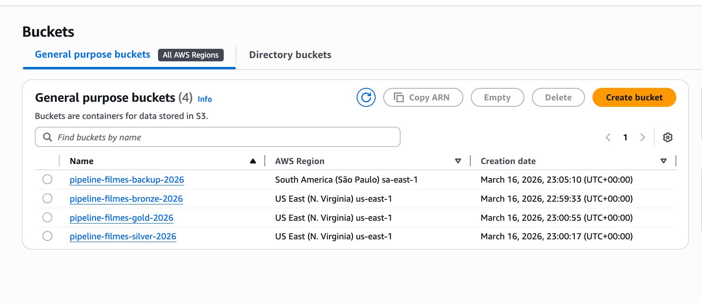

A replicação cross-region é automática: qualquer arquivo que entra no Bronze ou Silver já vai para São Paulo sem intervenção manual. O bucket de backup espelha tanto o dado bruto quanto o transformado.

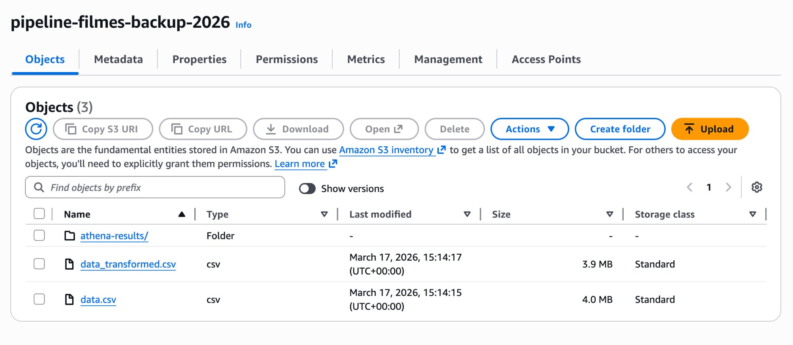

**Bronze** — dado bruto (4.0 MB):

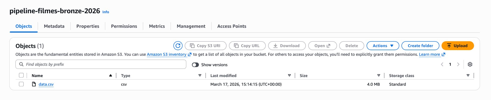

**Silver** — dado transformado e pronto para análise (3.9 MB):

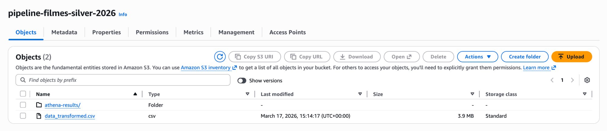

**Gold** — 12 arquivos, um por década:

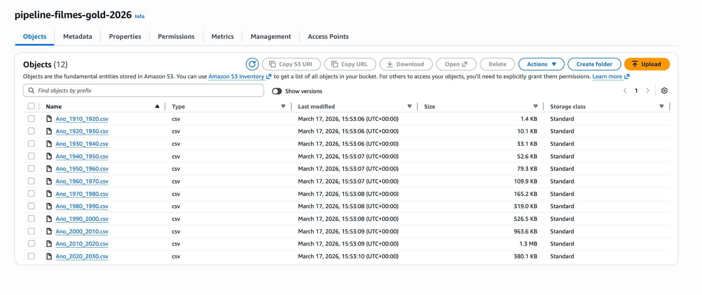

---

## AWS Glue

O Glue Crawler (`crawler-silver`) catalogou a camada Silver em 1 minuto e 25 segundos, criando automaticamente a tabela `pipeline_filmes_silver_2026` no banco `db_silver`.

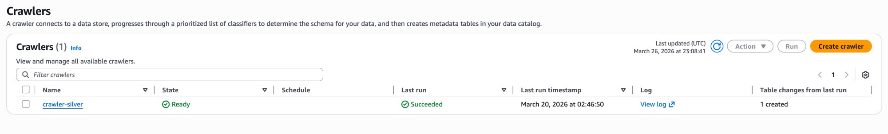

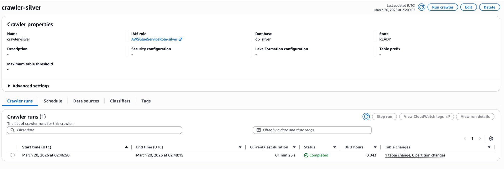

A tabela fica disponível no Data Catalog apontando direto para o S3:

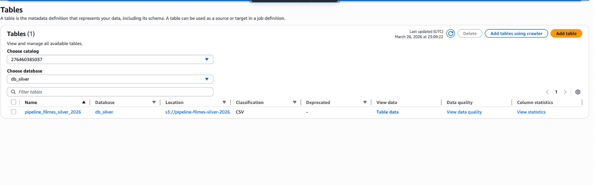

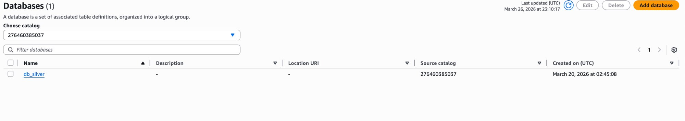

---

## Amazon Athena

Com os dados catalogados, dá pra rodar SQL direto no S3 — sem mover nada, sem provisionar banco.

O workgroup usa Athena Engine v3 com autenticação via IAM:

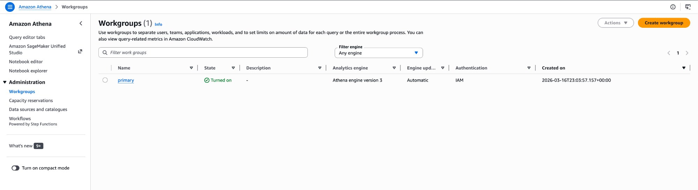

O banco `db_silver` aparece como fonte de dados via AWS Glue Data Catalog:

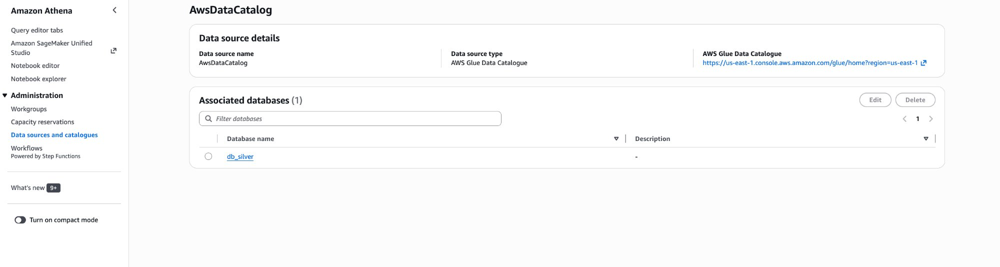

Query de validação rodando na tabela Silver — 617ms, 2.69 MB escaneados:

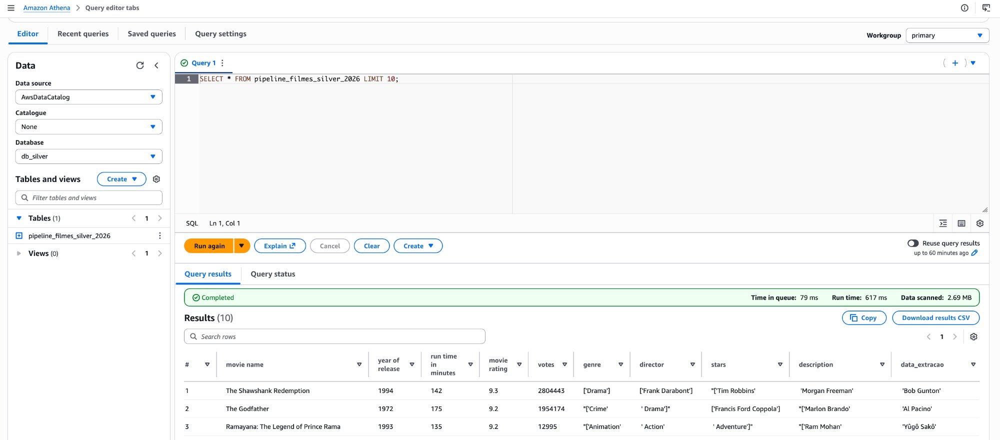

---

## Como executar

O projeto usa [uv](https://github.com/astral-sh/uv) para gerenciar dependências.

```bash
# Instalar dependências
uv sync

# Transformar os dados
uv run src/transform.py

# Subir para o S3
uv run src/upload_s3.py

# Gerar camada Gold
uv run src/gold.py
```

> Você vai precisar de credenciais AWS configuradas localmente (`aws configure`) com permissão de escrita nos buckets S3.

---

## Estrutura do projeto

```
pipeline-filmes/
├── data/
│   ├── raw/          ← dado original
│   ├── staging/      ← dado transformado
│   └── gold/         ← dado particionado por década
├── src/
│   ├── transform.py
│   ├── upload_s3.py
│   └── gold.py
├── notebooks/
│   └── explore.ipynb
└── README.md
```

---

## Stack

| Categoria | Tecnologia |
|---|---|
| Transformação | Python 3.13 · pandas · boto3 |
| Gerenciador de pacotes | uv |
| Armazenamento | Amazon S3 |
| Rede | AWS VPC |
| Catalogação | AWS Glue |
| Consulta | Amazon Athena |

---

## Status

- [x] Pipeline ETL (Bronze → Silver → Gold)
- [x] Upload para S3
- [x] VPC + subnets + route tables
- [x] Replicação cross-region (backup em São Paulo)
- [x] Glue Crawler + Data Catalog
- [x] Consultas com Athena
